# Hello dogs! 🐕 
## An 💯% honest (and very subjective!) ranking of Berkeley / NorCal food places. ja bitte bb ⛅️ 

### Almare Gelato Italiano 🍨 
2170 Shattuck Ave., Berkeley, CA 94704

*Lively treat spot serving updated old-world Italian gelato & sorbet flavors with vegan options.*

10🌟/10

I must start off this ranking with my all-time favorite ice cream / gelato place ever. Jaja. Almare *never* misses. Firstly, it is such a cool, cute shop with rotating gelato flavors (my personal favorite: strawberry 🍓  + ube 🍠 !). The fruit sorbet are incredibly fresh, and the gelato is so creamy and delicious. Not to mention, it is **so** worth the buckaroos 💴! They pack the cup, and allow you to mix and match flavors to your desire, even down to the ratios! The location is also Downtown and is very lovely. It's also right next to the hearty BART, so if you're feeling a bit snacky after a BART 🚊 ride, you will go here. Yes you will. 

  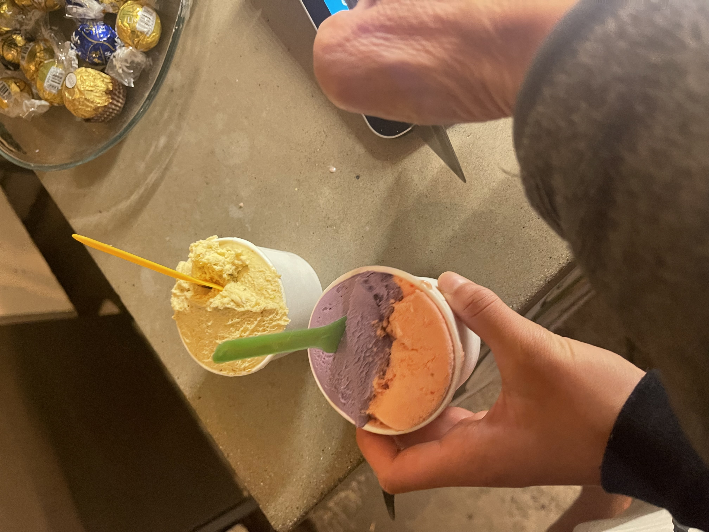
  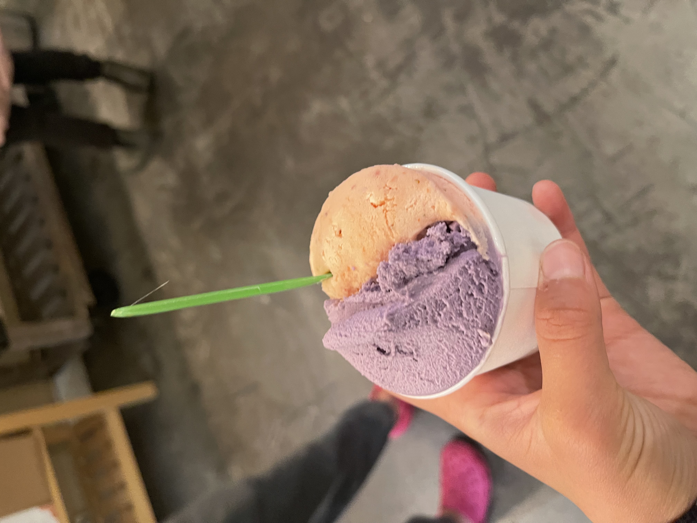

### Bagel Street Cafe 🥯 
2148 Center St, Berkeley, CA 94704

*Casual eatery serving a range of housemade bagels, coffee, sandwiches, salads & drinks.*

8🌟/10

The location is very rad and convenient, and is a great place to grab a quick breakfast before going to class. I went here two times in a row for breakfast. 🍳 Although this is an egg emoji, there was no egg in either of the bagels I ordered.
I enjoyed the lox bagel. It was definitely worth the money 💰. It was so much that I had to ask my father to finish it. The second bagel was simply an everything bagel with cream cheese. Yum! 
I did catch a fly on one of the bagels though... #notrad.

No picture was taken. Therefore, here is a picture of the store that I took from Google:

 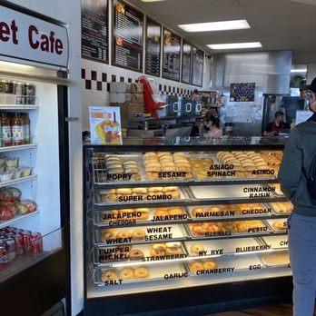

### Taiwan Professional Tea ☕️ 
2383 Telegraph Ave, Berkeley, CA 94704

8🌟/10

Ja. So I, like many others, quite *enjoy* boba. 🧋 So, I knew I *had* to find a good boba place. This was recommended. And it was not too bad #bros! I actually really enjoyed it! Father and I shared a milk and fruit tea and interchanged them whenever we pleased, and it was quite a good combination, especially in conjunction with the view 📷 of the Berkeley marina (which is where we drove to). I also went here later with Mother, and we both quite Enjoyed it. Ja bitte. I like it. It's a Yes. I guess. No. I know. ✔️  For some reason, I did not take a picture (of either times), but I will be including a pleasing picture from the interweb. 

 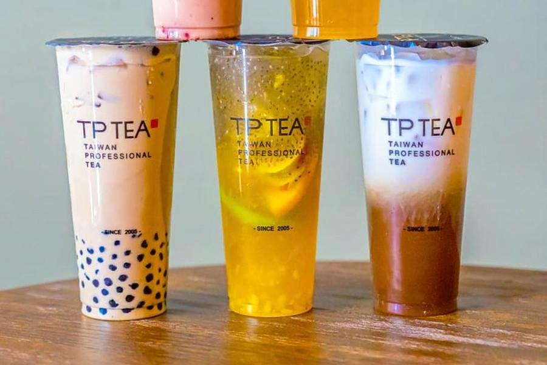

### Burma Superstar 💫 
4721 Telegraph Ave, Oakland, CA 94609

*Relaxed eatery dishing up Burmese noodle, rice & meat dishes, plus vegetarian options.*

8🌟/10

This was one of the top-rated restaurants in Oakland. Jaja. #tbh had a quite emotional experience 💧 here as this was my last day with my dad before going off on my own...but it was a great place! We got really lucky with the lack of wait, and the waiters were very kind. 👄 For example, we ordered one of their signature salads, and they tossed it for us and made lovely conversation. 👏 
The food was quite delicious, but not anything *crazy* good. Yes. But I very much enjoyed it!
I probably would go here again, but also, I might not. 
But again, it was quite enjoyable!
Ja. ❤️ 

 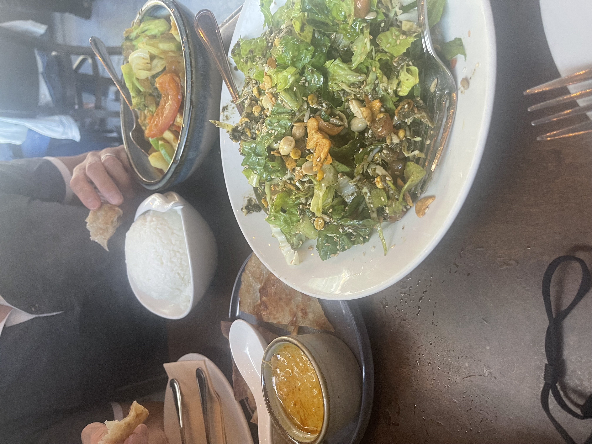

### Crossroads 🚗 
2415 Bowditch St, Berkeley, CA 94720

*UC Berkeley Dining Hall*

7🌟/10

I don't go here often. Sometimes, the environment is very loud 👂 and overwhelming. However, the food is not too bad, and has many choices. Ja. If I had to pay full-price to go here, I would not step foot in the building. However, props to the chefs. 👩‍🍳 👨‍🍳 

 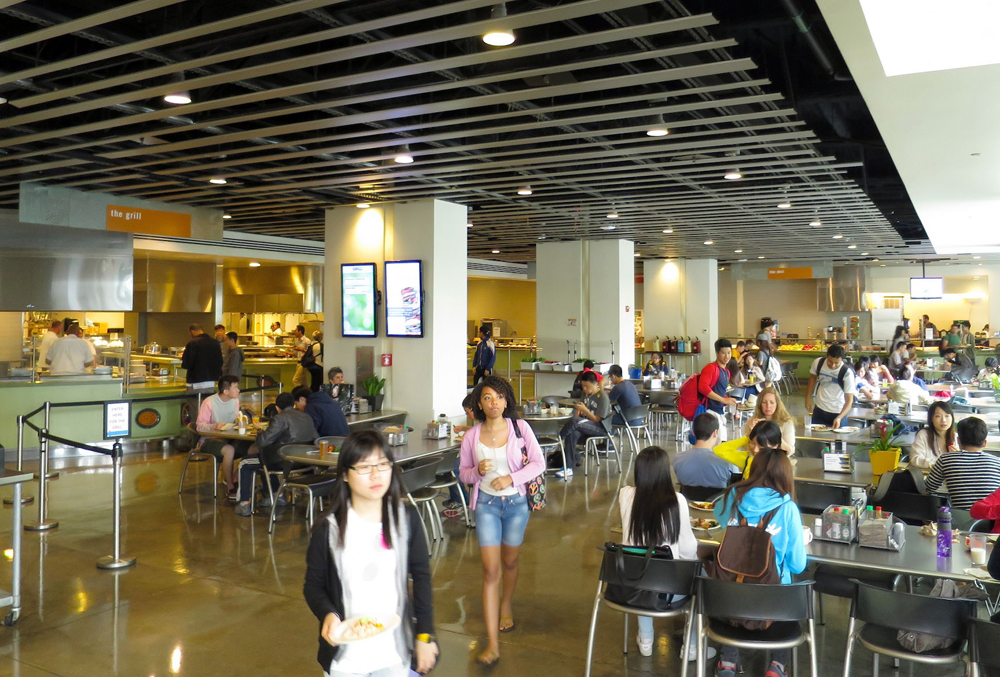

### Cafe 3 🥕 
2400 Durant Ave, Berkeley, CA 94704

*UC Berkeley Dining Hall*

6🌟/10

Listen. It's definitely a hit or miss... 🎯 but also, I've been able to eat in Cafe 3 for free this entire summer. Therefore, I am choosing to focus on the positives. 
Some of my favorites:

✅ grilled broccoli 🥦 

✅ soyrizo scramble + brown rice 🍚 

✅ pineapple salmon🎣 

✅ breaded cod 🐠 

 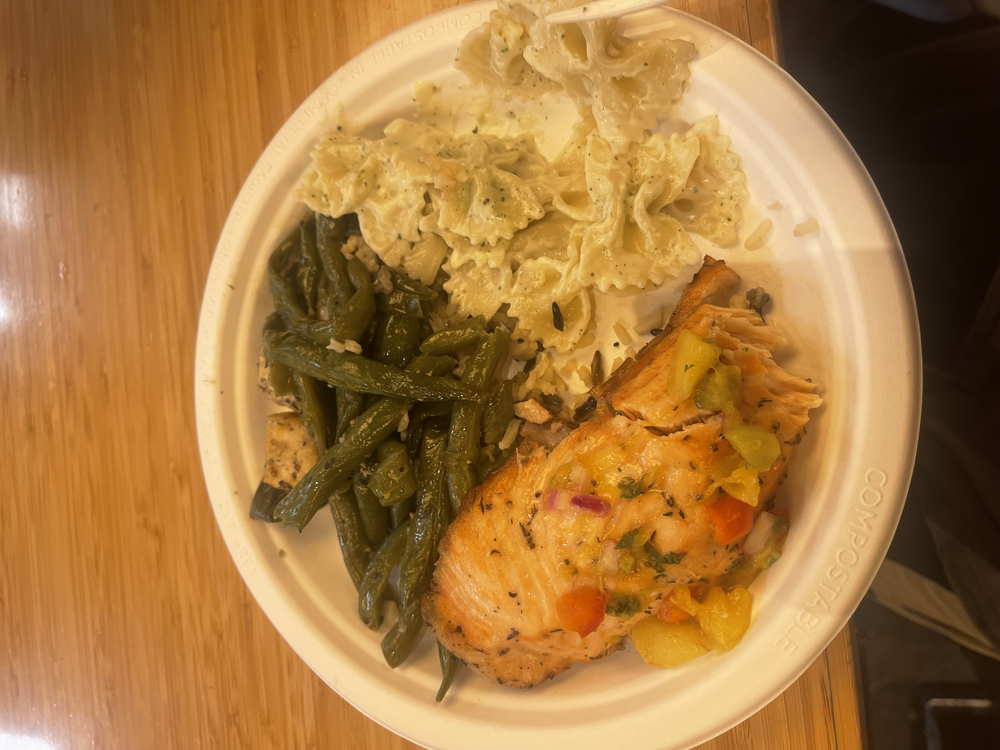

### Riceful Onigiri 🍙 
2435 Durant Ave, Berkeley, CA 94704

9🌟/10

Yes. Very much so! I love this place. It's quick and convenient, and mighty tasty. 👅  I love spamisubi, but I only rarely ate it back at home. This is spamisubi with a twist! 👏 Jaja. I've gone here probably 4 times already, and I've had the pork katsu and shrimp 🍤 . They are both very delicious, and I am definitely coming back. 🦀 

 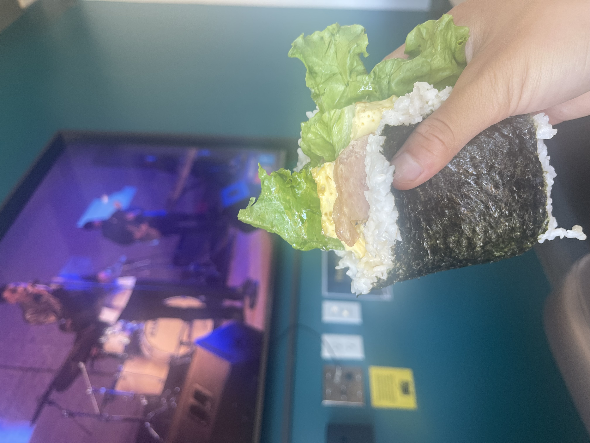

### Dumpling Kitchen 🥟 
2517 Durant Ave Ste A, Berkeley, CA 94704

*Dim sum for take-out*

6🌟/10

Yoo sup bros. This was one of my first times using #Snackpass, and I thought it was not too bad, but I wouldn't go here...again. Jaja. Sorry ❤️; it was pretty solid fried gyoza, but the soup dumplings 🥟  were, as the kids say, a bit "mid." I also ordered some seaweed salad, which wasn't bad. But it wasn't phenomenal. All love and peace. ☮️ I enjoyed it. Jaja. Both of these pictures are taken from Google. Unfortunately, I did not capture any pictures of any of the food.

  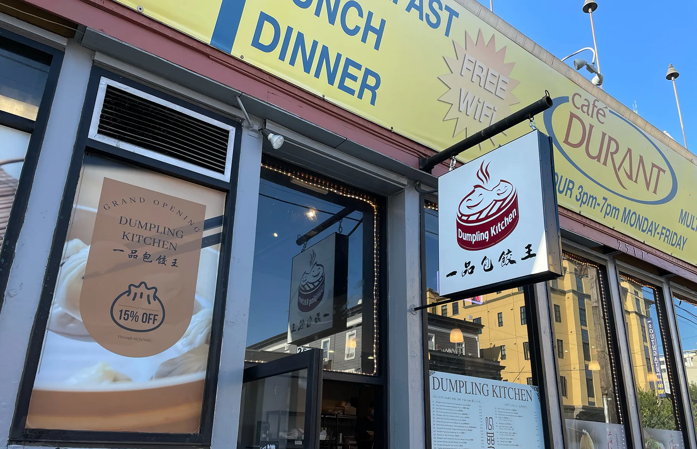
  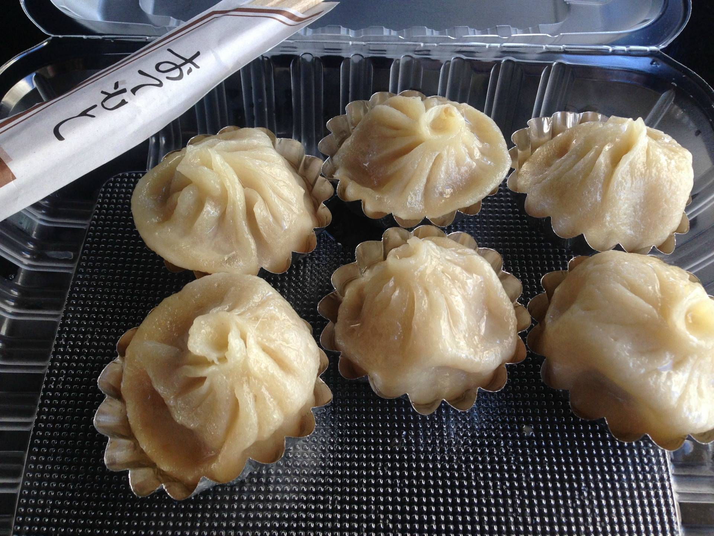

### Yogurt Park 🍦 
2433 Durant Ave A, Berkeley, CA 94704

*Long-running (since 1977) shop, open late, offering frozen yogurt in simple digs.*

9🌟/10 

Jaja I definitely recommend! Although I have not been here much, this is simply such a wonderful little shop! The fro-yo flavors are so tasty 👅, the service is quick 🏃‍♀️🏃‍♂️, and it is the perfect post-meal snack / dessert 🧁. The flavors are much richer and quite different from the traditional fro-yo chains like "YogurtLand" or "PinkBerry." 💗 

  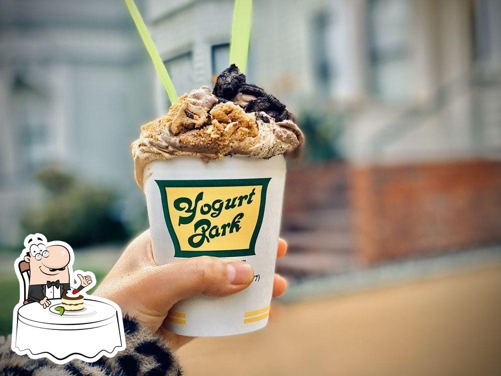

### Boba Ninja 🥷 
2519 Durant Ave, Berkeley, CA 94704

*Bubble tea store with popcorn chicken that's the bomb dot com*

10🌟/10 

### U-Cha 🕊 
2199 Bancroft Way, Berkeley, CA 94720

*Chill counter in a simple modern storefront for iced & bubble tea drinks with creative snacks.*

9🌟/10 

### Imm Thai Street Food 🥣 
2068 University Ave, Berkeley, CA 94704

*Thai street eats, plus beer & wine, in a buzzing, casual spot with understated decor.*

8🌟/10 

### Sourdough and Co 🥖 
2509 Haste St, Berkeley, CA 94704

8🌟/10 

### Bonchon Berkeley 🍗
2050 Berkeley Way, Berkeley, CA 94704

*Casual chain serving cooked-to-order Korean fried chicken, plus other traditional eats.*

7🌟/10 

### Alley Kitchens 🍜 
2309 Telegraph Ave, Berkeley, CA 94704

*Ramen, matcha & Japanese bites offered in snug surrounds inspired by Tokyo's street-food cafes.*

8🌟/10 

### Gott's Roadside 🍔 
One Ferry Building, The Embarcadero S, San Francisco, CA 94111

*This retro eatery offers locally sourced burgers, fish tacos & beer, plus outdoor picnic tables.*

8🌟/10 

### Humphry Slocombe 👅 
One Ferry Building #8, San Francisco, CA 94111

*Small shop selling ice cream made from high-end ingredients, including unusual flavors like cheese.*

10🌟/10 

### Kimchi Garden 🪴 
2517 Durant Ave suite B, Berkeley, CA 94704

*Casual destination serving standard Korean noodle dishes, barbecue & kimchi in a cozy space.*

7🌟/10 

### Caffe Strada 🥪 
2300 College Ave, Berkeley, CA 94704

*Popular among students, this tree-shaded cafe provides a kick with coffee drinks, teas & pastries.*

I quite love 💕  Caffe Strada! Truly! I first went here for "Coffee Chats" with my Data 6 instructor 👑 

9🌟/10 

### Sharetea 🫖 
2328 Telegraph Ave, Berkeley, CA 94704

7🌟/10 

### Purple Kow 🐄 
2164 Center St, Berkeley, CA 94704

*Asian-influenced sweets menu featuring flavored teas, jelly drinks & assorted snacks & desserts.*

8🌟/10 

### Pla Daek Thai Esan Food 🥘 
4133 Piedmont Ave, Oakland, CA 94611

10🌟/10 

### Top Dog 🌭 
2534 Durant Ave, Berkeley, CA 94704

*Quick-serve sausages including specialties & veggie options served in a minimalist setting.*

9🌟/10 

### Hui Lau Shan 🥭 
2282 Fulton St, Berkeley, CA 94704

8🌟/10 

### Berkeley Social Club 🕺 
2050 University Ave, Berkeley, CA 94704

*Lively spot serving eclectic Asian-American fare with beer & wine in expansive quarters.*

9🌟/10

I heard Good 👍 reviews about this place, and it was quite lovely!! Parking is quite the nightmare around this area, but the food was simply delightful! Pancakes 🥞, strawberry 🍓 avocado 🥑 toast, bulgogi rice bowl, beautiful candied bacon 🥓 , fried chicken salad...there was just so much! And they were all finger-licking #delicious. Would definitely go here again (given the bucks and the chance)!

  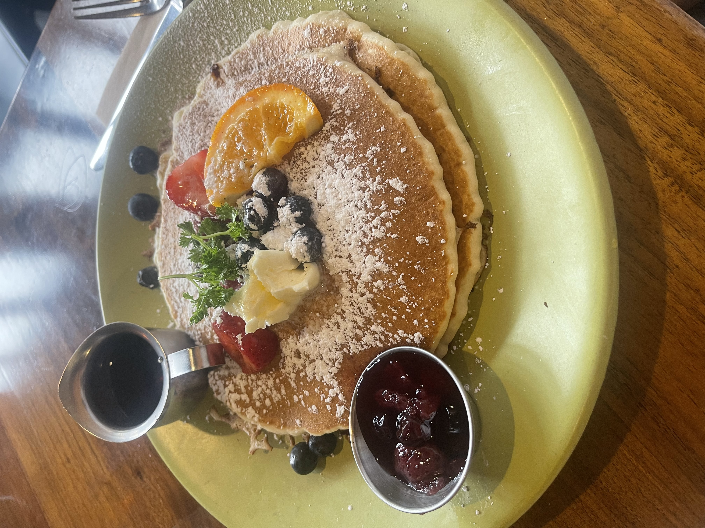
  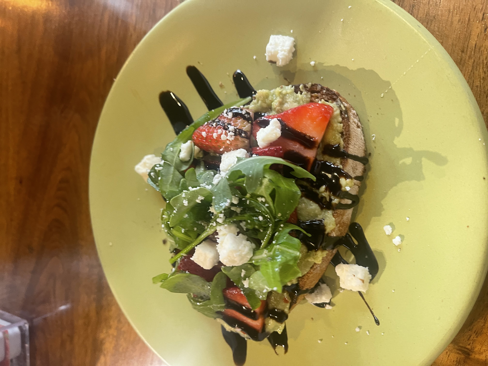
  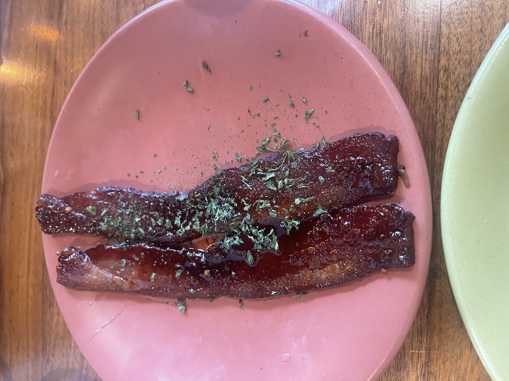

### SoDoi Coffee Tasting House 🏡
2438 Durant Ave, Berkeley, CA 94704

*Airy, industrial stop with reclaimed wood tables & a bright wall mural serves caffeinated beverages.*

9🌟/10 

### Koo 🍣 
408 Irving St, San Francisco, CA 94122

*High-quality sushi & innovative grilled plates in basic digs with tables & sushi bar seating.*

9🌟/10 

### Ben & Jerry's 🧊 
2130 Center St Suite 102, Berkeley, CA 94704

*Iconic Vermont-based ice cream parlor chain, known for its creative, cleverly named flavors.*

5🌟/10 

### 

### Dumpling 🥟 

### Boba Guys

### Chowders 🥖 

